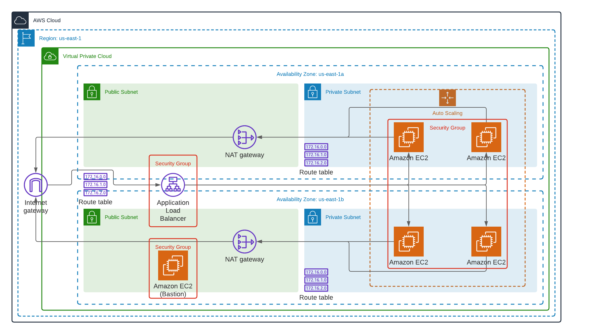

# Cloudformation example

A simple solution deployed using Cloudformation. 

## Project Structure

* **images**: Images assets
* **parameters**: Deployment parameters used by ```deploy.sh```
* **utils**: Helper scripts
* **application.yml**: Deploy the application components (ASG, ALB and related components)
* **deploy.sh**: Deployment script
* **network.yml**:  Deploy the network components (VPC, NAT, Bastion, Subnets and related components)

## Architecture




## Deployment

After updating the parameters in the parameters folder, we only need to run the command:

```
./deploy.sh <application name> <stack name>
```

### Examples:

In order to deploy the network stack:

```
./deploy.sh myapplication network
```

To deploy the application stack:

```
./deploy.sh myapplication application
```